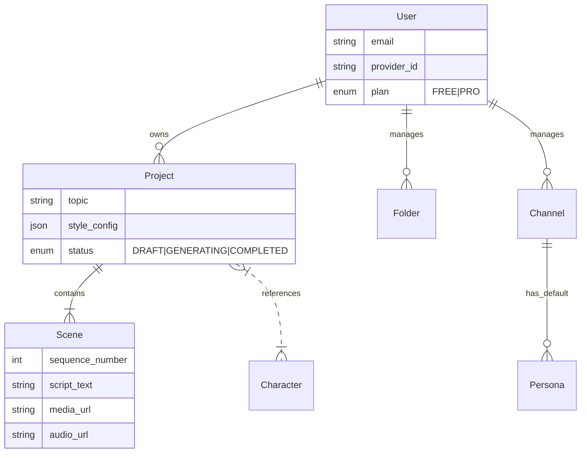

# ShortsAI API Wiki

## 1. Description
The **ShortsAI API** is the backend core of the ShortsAI platform. It is built using **Next.js (App Router)** and serves as the central orchestrator for user authentication, data persistence, and managing the AI generation pipeline (Text/Image/Audio).

> **Note**: This backend NO LONGER performs video rendering. Rendering has been moved to the client-side (Studio) to reduce infrastructure costs.

## 2. Architecture

### Tech Stack
- **Framework**: Next.js 15 (App Router)
- **Language**: TypeScript
- **Database**: PostgreSQL (via Prisma ORM)
- **Authentication**: NextAuth.js (v5 Beta)
- **Storage**: Cloudflare R2 (via AWS SDK v3)
- **AI Integration**: Google Gemini (Script/Image), ElevenLabs (Audio), Groq (Fast TTS).

### High-Level Design
The API follows a monolithic structure within Next.js route handlers. It implements a **Serverless-First Architecture**:

1.  **Synchronous Operations**: CRUD for Users, Projects, Scenes.
2.  **AI Asset Generation**:
    -   The API acts as a secure proxy to AI providers.
    -   It manages prompts, context, and rate limits.
    -   It uploads generated assets (Images/Audio) to R2 and returns URLs to the frontend.

### Key Modules
- **`app/api/`**: REST endpoints organized by resource (`users`, `projects`, `personas`, `channels`).
- **`lib/ai/`**: Services for interacting with AI Providers (`chat-service`, `image-service`, `audio-service`).
- **`lib/core/`**: Shared utilities (Prisma client, Auth helpers, Key Manager).

## 3. Data Model (UML Abstract)
The database schema relies on Users owning Projects, which contain Scenes.



## 4. Deployment

### Infrastructure
- **Type**: Containerized (Docker)
- **Platform**: VPS (Coolify/Dokku) or Google Cloud Run.
- **Environment**: Requires `DATABASE_URL` (Postgres) and R2 credentials.

### Build & Run
The project uses a standard Next.js build process.

```bash
# Install dependencies
npm install

# Generate Prisma Client
npx prisma generate

# Run Development
npm run dev

# Build for Production
npm run build
npm start
```

### Docker
The `Dockerfile` builds a standalone Next.js application designed to minimize image size.
