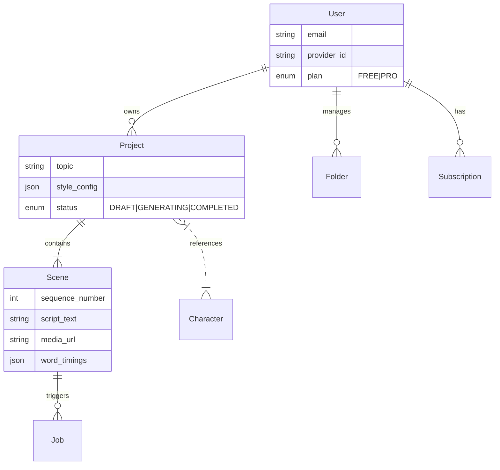

# ShortsAI API Wiki

## 1. Description
The **ShortsAI API** is the backend core of the ShortsAI platform. It is built using **Next.js (App Router)** and serves as the central orchestrator for user authentication, data persistence, and managing the video generation pipeline. It exposes RESTful endpoints for the frontend (Studio) and communicates with the Python Worker for media rendering.

## 2. Architecture

### Tech Stack
- **Framework**: Next.js 15 (App Router)
- **Language**: TypeScript
- **Database**: PostgreSQL (via Prisma ORM)
- **Queue/Caching**: Redis (BullMQ for job queues, IoRedis for caching)
- **Authentication**: NextAuth.js (v5 Beta)
- **Storage**: Cloudflare R2 (via AWS SDK v3)
- **AI Integration**: Google Gemini, ElevenLabs

### High-Level Design
The API follows a monolithic structure within Next.js route handlers. It implements a **Hybrid Architecture**:
1.  **Synchronous Operations**: CRUD for Users, Projects, Scenes (handled directly by Next.js API routes).
2.  **Asynchronous Operations**: Video rendering jobs are pushed to a Redis queue (or directly via HTTP to the Worker in the current Cloud Run setup) and monitored via status polling.

### Key Modules
- **`app/api/`**: REST endpoints organized by resource (`users`, `projects`, `render`, etc.).
- **`lib/`**: Shared utilities (Redis connection, Prisma client, Auth helpers).
- **`worker/`**: (Source code for the Python worker is co-located here but deployed separately).

## 3. Data Model (UML Abstract)
The database schema relies on Users owning Projects, which contain Scenes.



## 4. Deployment

### Infrastructure
- **Type**: Containerized (Docker)
- **Platform**: VPS (Coolify/Dokku) or Google Cloud Run.
- **Environment**: Requires `DATABASE_URL` (Postgres), `REDIS_URL` (Redis), and R2 credentials.

### Build & Run
The project uses a standard Next.js build process.

```bash
# Install dependencies
npm install

# Generate Prisma Client
npx prisma generate

# Run Development
npm run dev

# Build for Production
npm run build
npm start
```

### Docker
The `Dockerfile` builds a standalone Next.js application designed to minimize image size.
