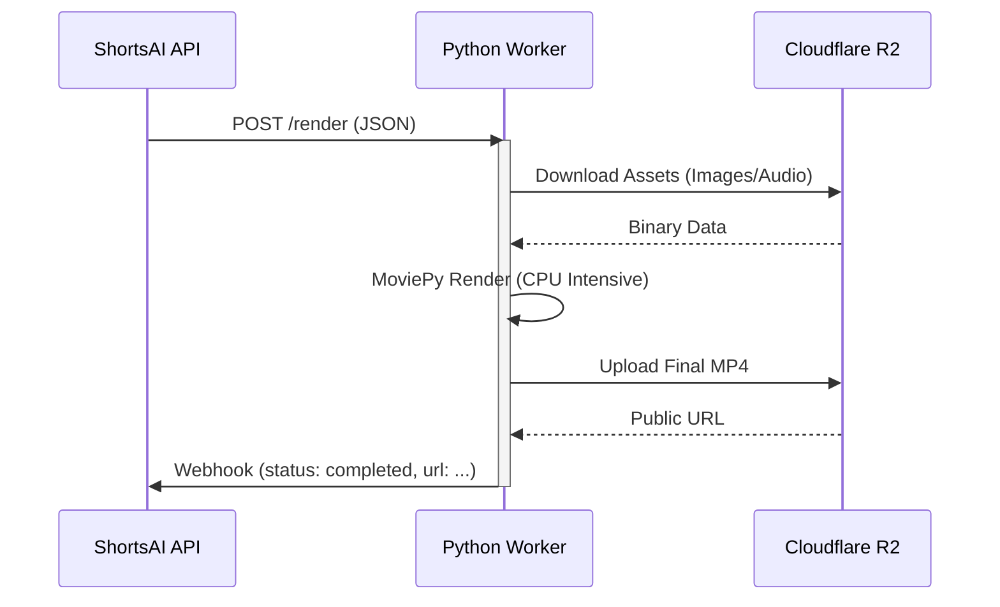

# ShortsAI Worker Wiki

## 1. Description
The **ShortsAI Worker** is a specialized Python service designed for high-performance media processing. It acts as the "rendering engine" of the platform, taking structured scenes and assets (images, audio, subtitles) and compiling them into a final video (MP4) using **MoviePy**.

## 2. Architecture

### Tech Stack
- **Framework**: FastAPI
- **Language**: Python 3.10+
- **Core Library**: MoviePy 1.0.3 (Video Editing)
- **Image Processing**: Pillow (with AntiAlias patch)
- **Storage**: AWS SDK for Python (`boto3`) connecting to Cloudflare R2
- **Utilities**: `numpy`, `scipy`

### Processing Pipeline
The worker operates sequentially on a per-job basis (optimized for Cloud Run scaling):

1.  **Receive Job**: `POST /render` payload containing project ID, scene list (images/audio URLs), and music configuration.
2.  **Asset Acquisition**: Downloads all referenced assets from R2 (Images, TTS Audio) to a local temp directory.
3.  **Scene Assembly**:
    -   **Visual**: Applies "Ken Burns" effect (zoom/pan) to static images to create dynamic video clips.
    -   **Audio**: Syncs narration audio with the visual clip.
    -   **Subtitles**: Generates burned-in subtitles (TextClips) based on word-level timestamps.
4.  **Concatenation**: Stitches all scene clips together.
5.  **Final Mix**: Overlays background music with volume ducking/looping.
6.  **Encoding**: Renders the final timeline to MP4 (H.264/AAC) optimized for speed (`ultrafast`/`veryfast` preset).
7.  **Delivery**: Uploads the result to R2 and fires a webhook callback to the API.

## 3. Data Flow (UML Abstract)



## 4. Deployment

### Infrastructure
- **Platform**: Google Cloud Run (recommended) or any Docker-compatible host.
- **Resources**: High CPU requirement. At least 2 vCPUs and 2GB+ RAM recommended for rendering 1080p content.
- **System Deps**: Requires `ImageMagick` installed in the container for TextClip generation.

### Docker
The `Dockerfile` handles the complex dependency chain (System libs -> Python reqs -> ImageMagick config).

### Run Locally
```bash
# Install System Deps (ImageMagick)
# ...

# Install Python Deps
pip install -r requirements.txt

# Run Server
uvicorn main:app --reload --port 8000
```
